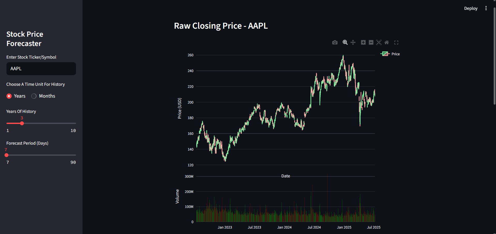
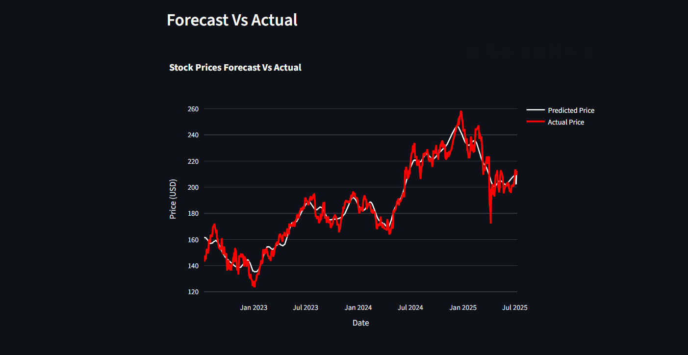
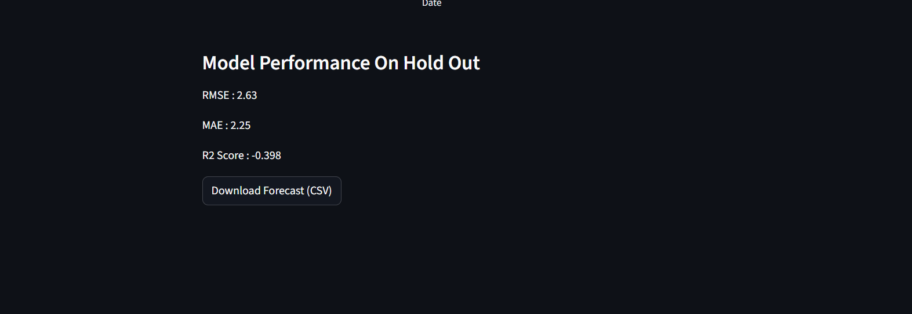
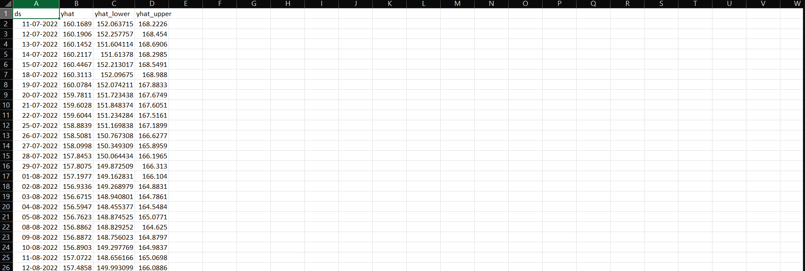
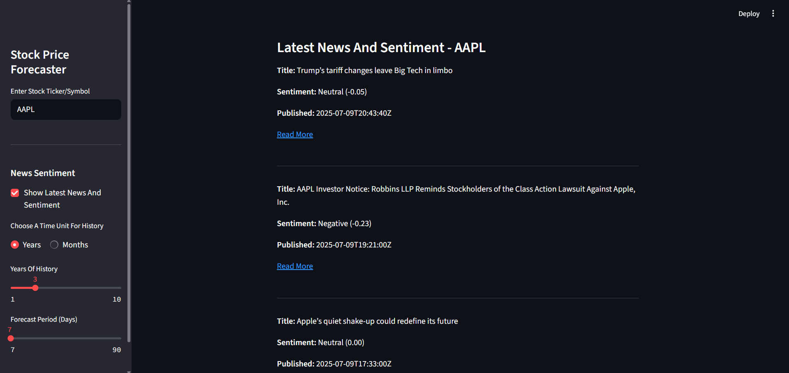

# 📈 Stock Price Forecasting App (Prophet + Streamlit)

An AI-powered forecasting and analysis tool that lets users explore and predict stock prices for any ticker (e.g., `AAPL`, `TSLA`, `INFY`). Built using **Facebook Prophet**, **Streamlit**, and **Plotly**, it combines **technical analysis**, **time series forecasting**, and **news sentiment** — all in one interactive dashboard.

---

## 🌐 Live App

👉 Try it now on **Streamlit Cloud**:  
[Live Demo](https://adityachauhan99-stock-forecasting-app.streamlit.app)  

---

## 🚀 Features

### 🔍 Stock Data & Visualization
- Input any valid **stock ticker** (e.g., `AAPL`, `MSFT`, `INFY`)
- Choose custom historical range (in **months** or **years**)
- View interactive **candlestick chart** with:
  - 📉 SMA (Simple Moving Average - 20 days)
  - 📈 EMA (Exponential Moving Average - 20 days)
  - 🟣 RSI (Relative Strength Index - 14 days)
- Overlay **Volume bars** by date (green/red based on daily trend)

### 📊 Forecasting with Prophet
- Automatically load OHLCV data via **yfinance**
- Forecast **up to 90 days** into the future using **Prophet**
- Visualize **Forecast vs Actual** closing prices in dual-line plot
- Display **evaluation metrics**:
  - ✅ RMSE (Root Mean Squared Error)
  - ✅ MAE (Mean Absolute Error)
  - ✅ R² Score (Coefficient of Determination)
- Download forecast results as `.csv`

### 🧠 News Sentiment Analysis
- Pull latest real-world stock news using **NewsAPI**
- Apply **VADER sentiment analysis** to headlines
- Display:
  - 📰 Article title
  - 🎯 Sentiment (Positive / Neutral / Negative)
  - ⏱️ Publication timestamp
  - 🔗 Link to full article

### 🧑‍💻 Clean Streamlit UI
- Dark mode-friendly design
- Sidebar input controls for:
  - Stock ticker
  - History range
  - Forecast window
  - Toggle for news sentiment
- Responsive layout with 3-panel visualization

---

## 📸 App Screenshots

### 🔹 Candlestick + Technical Indicators


### 🔹 Forecast vs Actual Prices


### 🔹 Evaluation Metrics


### 🔹 Download Forecast as CSV


### 🔹 News Sentiment Output


---

## 🛠 How to Run Locally

```bash
git clone https://github.com/your-username/stock-price-forecasting-app.git
cd stock-price-forecasting-app
python -m venv venv
source venv/bin/activate        # On Windows: venv\Scripts\activate
pip install -r requirements.txt
streamlit run stock_forecasting_app.py
